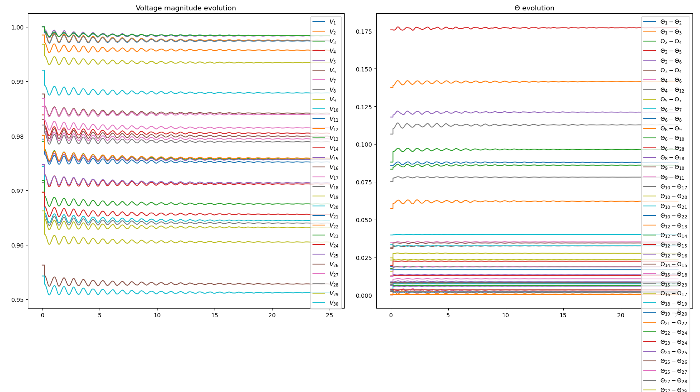
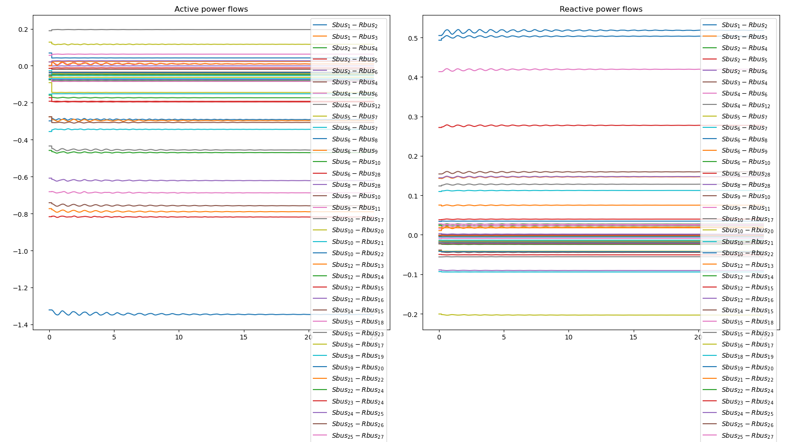
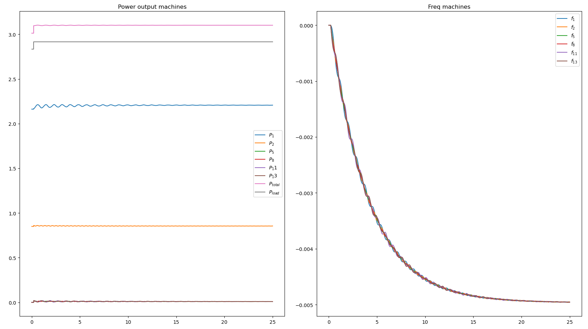

# PINNs-for-IEEE-systems
This library provides power system dynamic solvers implemented in PyTorch based on the simultaneous solution algorithm. The developed algorithms, based on Runge-Kutta integration schemes, allow the integration of Physics-Informed Neural Networks (PINNs), boosting their computation performance and unlocking a wide range of modeling and privacy opportunities. The solvers are implemented using test systems from the IEEE test system library available at [ieeelib](http://publish.illinois.edu/smartergrid/).

PINNs are integrated as a more accurate alternative to traditional Runge-Kutta schemes over larger time steps.

The motivation, methodology, and applications are discussed in the following paper under review:

Ignasi Ventura, Rahul Nellikkath, and Spyros Chatzivasileiadis. "Physics-Informed Neural Networks in Power System Dynamics: Improving Simulations' Accuracy." 2025.

## Installation

To install the latest on GitHub:

```
pip install git+https://github.com/ignvenad/PINNs-for-IEEE-systems
```

## Figures for the IEEE 30-bus System $L^{20}_{+0.08}$ simulation

### Voltage evolution
<p align="center">

</p>

### Line power flows
<p align="center">

</p>

### Generated power and frequency evolution
<p align="center">

</p>

## Simulation Tables
The following tables include more detailed information on the results provided in the paper. These values are obtained by comparing the traditional and hybrid files to the true file in the Simulations folder.
#### IEEE 30-Bus System ($L^{20}_{+0.08}$)
| Variable  | Value (%)  | Variable  | Value (%)  | Variable  | Value (%)  | Variable  | Value (%)  | Variable  | Value (%)  | Variable  | Value (%)  |
|-----------|--------|-----------|--------|-----------|--------|-----------|--------|-----------|--------|-----------|--------|
|$\delta_{1}$ | 2.37      |$\delta_{2}$ | 39.24     |$\delta_{5}$ | 6.00      |$\delta_{8}$ | 6.98      |$\delta_{11}$ | 1.39      |$\delta_{13}$ | 1.89      |
|$\omega_{1}$ | 0.50      |$\omega_{2}$ | 38.88     |$\omega_{5}$ | 3.03      |$\omega_{8}$ | 4.64      |$\omega_{11}$ | 1.68      |$\omega_{13}$ | 1.06      |
|$Id_{1}$   | 2.16      |$Iq_{1}$   | 18.09     |$Id_{2}$   | 37.65     |$Iq_{2}$   | 39.36     |$Id_{5}$   | 7.72      |$Iq_{5}$   | 6.00      |
|$Id_{8}$   | 8.24      |$Iq_{8}$   | 6.98      |$Id_{11}$  | 4.47      |$Iq_{11}$  | 1.40      |$Id_{13}$  | 3.48      |$Iq_{13}$  | 1.89      |
|$Vm_{1}$   | 0.57      |$Vm_{2}$   | 0.84      |$Vm_{3}$   | 2.80      |$Vm_{4}$   | 3.57      |$Vm_{5}$   | 7.82      |$Vm_{6}$   | 4.97      |
|$Vm_{7}$   | 5.80      |$Vm_{8}$   | 8.33      |$Vm_{9}$   | 4.41      |$Vm_{10}$  | 4.25      |$Vm_{11}$  | 4.44      |$Vm_{12}$  | 3.44      |
|$Vm_{13}$  | 3.46      |$Vm_{14}$  | 3.56      |$Vm_{15}$  | 3.84      |$Vm_{16}$  | 4.05      |$Vm_{17}$  | 4.18      |$Vm_{18}$  | 4.13      |
|$Vm_{19}$  | 4.16      |$Vm_{20}$  | 4.18      |$Vm_{21}$  | 4.29      |$Vm_{22}$  | 4.31      |$Vm_{23}$  | 4.25      |$Vm_{24}$  | 4.55      |
|$Vm_{25}$  | 5.51      |$Vm_{26}$  | 5.51      |$Vm_{27}$  | 6.19      |$Vm_{28}$  | 5.46      |$Vm_{29}$  | 6.19      |$Vm_{30}$  | 6.19      |

#### IEEE 30-Bus System ($G^{1}_{-0.3}$)
| Variable  | Value (%)  | Variable  | Value (%)  | Variable  | Value (%)  | Variable  | Value (%)  | Variable  | Value (%)  | Variable  | Value (%)  |
|-----------|--------|-----------|--------|-----------|--------|-----------|--------|-----------|--------|-----------|--------|
|$\delta_{1}$ | 0.74      |$\delta_{2}$ | 39.74     |$\delta_{5}$ | 7.96      |$\delta_{8}$ | 21.69     |$\delta_{11}$ | 0.64      |$\delta_{13}$ | 0.95      |
|$\omega_{1}$ | 0.38      |$\omega_{2}$ | 39.51     |$\omega_{5}$ | 4.31      |$\omega_{8}$ | 14.34     |$\omega_{11}$ | 0.59      |$\omega_{13}$ | 0.67      |
|$Id_{1}$   | 0.62      |$Iq_{1}$   | 35.43     |$Id_{2}$   | 38.01     |$Iq_{2}$   | 39.46     |$Id_{5}$   | 6.80      |$Iq_{5}$   | 8.02      |
|$Id_{8}$   | 4.72      |$Iq_{8}$   | 21.78     |$Id_{11}$  | 3.75      |$Iq_{11}$  | 0.74      |$Id_{13}$  | 2.83      |$Iq_{13}$  | 0.95      |
|$Vm_{1}$   | 0.46      |$Vm_{2}$   | 0.68      |$Vm_{3}$   | 2.20      |$Vm_{4}$   | 2.67      |$Vm_{5}$   | 6.89      |$Vm_{6}$   | 3.47      |
|$Vm_{7}$   | 4.02      |$Vm_{8}$   | 4.89      |$Vm_{9}$   | 3.36      |$Vm_{10}$  | 3.28      |$Vm_{11}$  | 3.55      |$Vm_{12}$  | 2.85      |
|$Vm_{13}$  | 2.81      |$Vm_{14}$  | 2.89      |$Vm_{15}$  | 3.01      |$Vm_{16}$  | 3.07      |$Vm_{17}$  | 3.21      |$Vm_{18}$  | 3.10      |
|$Vm_{19}$  | 3.17      |$Vm_{20}$  | 3.19      |$Vm_{21}$  | 3.28      |$Vm_{22}$  | 3.29      |$Vm_{23}$  | 3.14      |$Vm_{24}$  | 3.34      |
|$Vm_{25}$  | 3.86      |$Vm_{26}$  | 3.86      |$Vm_{27}$  | 4.13      |$Vm_{28}$  | 3.67      |$Vm_{29}$  | 4.13      |$Vm_{30}$  | 4.13      |

#### IEEE 30-Bus System ($L^{12}_{-0.11}$)
| Variable  | Value (%)  | Variable  | Value (%)  | Variable  | Value (%)  | Variable  | Value (%)  | Variable  | Value (%)  | Variable  | Value (%)  |
|-----------|--------|-----------|--------|-----------|--------|-----------|--------|-----------|--------|-----------|--------|
|$\delta_{1}$ | 3.55      |$\delta_{2}$ | 34.44     |$\delta_{5}$ | 11.30     |$\delta_{8}$ | 12.89     |$\delta_{11}$ | 0.08      |$\delta_{13}$ | 0.17      |
|$\omega_{1}$ | 1.26      |$\omega_{2}$ | 33.32     |$\omega_{5}$ | 6.87      |$\omega_{8}$ | 9.57      |$\omega_{11}$ | 0.15      |$\omega_{13}$ | 0.05      |
|$Id_{1}$   | 3.26      |$Iq_{1}$   | 29.51     |$Id_{2}$   | 33.30     |$Iq_{2}$   | 34.00     |$Id_{5}$   | 8.03      |$Iq_{5}$   | 11.30     |
|$Id_{8}$   | 7.63      |$Iq_{8}$   | 12.89     |$Id_{11}$  | 4.99      |$Iq_{11}$  | 0.06      |$Id_{13}$  | 3.56      |$Iq_{13}$  | 0.19      |
|$Vm_{1}$   | 0.93      |$Vm_{2}$   | 1.30      |$Vm_{3}$   | 3.42      |$Vm_{4}$   | 4.07      |$Vm_{5}$   | 7.97      |$Vm_{6}$   | 5.42      |
|$Vm_{7}$   | 6.42      |$Vm_{8}$   | 7.57      |$Vm_{9}$   | 5.14      |$Vm_{10}$  | 4.76      |$Vm_{11}$  | 5.07      |$Vm_{12}$  | 3.68      |
|$Vm_{13}$  | 3.62      |$Vm_{14}$  | 3.91      |$Vm_{15}$  | 4.57      |$Vm_{16}$  | 4.57      |$Vm_{17}$  | 4.89      |$Vm_{18}$  | 4.61      |
|$Vm_{19}$  | 4.86      |$Vm_{20}$  | 4.91      |$Vm_{21}$  | 4.91      |$Vm_{22}$  | 4.96      |$Vm_{23}$  | 4.60      |$Vm_{24}$  | 5.24      |
|$Vm_{25}$  | 6.00      |$Vm_{26}$  | 6.00      |$Vm_{27}$  | 6.36      |$Vm_{28}$  | 5.69      |$Vm_{29}$  | 6.36      |$Vm_{30}$  | 6.36      |

#### IEEE 9-Bus System - 100% step bus 8
| Variable  | Value (%)  | Variable  | Value (%)  | Variable  | Value (%)  | Variable  | Value (%)  | Variable  | Value (%)  | Variable  | Value (%)  |
|-----------|--------|-----------|--------|-----------|--------|-----------|--------|-----------|--------|-----------|--------|
|$\delta_{1}$ | 6.26      |$\delta_{2}$ | 19.26     |$\delta_{3}$ | 40.34     |$\omega_{1}$ | 4.82      |$\omega_{2}$ | 14.10     |$\omega_{3}$ | 39.87     |
|$Id_{1}$   | 24.63     |$Iq_{1}$   | 6.16      |$Id_{2}$   | 18.05     |$Iq_{2}$   | 22.83     |$Id_{3}$   | 40.20     |$Iq_{3}$   | 40.41     |
|$Vm_{1}$   | 26.37     |$Vm_{2}$   | 12.20     |$Vm_{3}$   | 13.44     |$Vm_{4}$   | 13.29     |$Vm_{5}$   | 11.29     |$Vm_{6}$   | 10.10     |


#### IEEE 14-Bus System - 100% step bus 14
| Variable  | Value (%)  | Variable  | Value (%)  | Variable  | Value (%)  | Variable  | Value (%)  | Variable  | Value (%)  | Variable  | Value (%)  |
|-----------|--------|-----------|--------|-----------|--------|-----------|--------|-----------|--------|-----------|--------|
|$\delta_{1}$ | 5.68      |$\delta_{2}$ | 44.38     |$\delta_{3}$ | 2.31      |$\delta_{6}$ | 1.76      |$\delta_{8}$ | 1.42      |$\omega_{1}$ | 0.66      |
|$\omega_{2}$ | 40.52     |$\omega_{3}$ | 0.08      |$\omega_{6}$ | 0.86      |$\omega_{8}$ | 1.03      |$Id_{1}$   | 5.19      |$Iq_{1}$   | 40.06     |
|$Id_{2}$   | 41.49     |$Iq_{2}$   | 43.68     |$Id_{3}$   | 7.21      |$Iq_{3}$   | 2.31      |$Id_{6}$   | 6.16      |$Iq_{6}$   | 1.76      |
|$Id_{8}$   | 1.22      |$Iq_{8}$   | 1.42      |$Vm_{1}$   | 0.12      |$Vm_{2}$   | 0.34      |$Vm_{3}$   | 7.19      |$Vm_{4}$   | 1.84      |
|$Vm_{5}$   | 1.89      |$Vm_{6}$   | 6.29      |$Vm_{7}$   | 1.02      |$Vm_{8}$   | 1.14      |$Vm_{9}$   | 0.69      |$Vm_{10}$  | 0.80      |

#### IEEE 30-Bus System - 100% step bus 30
| Variable  | Value (%)  | Variable  | Value (%)  | Variable  | Value (%)  | Variable  | Value (%)  | Variable  | Value (%)  | Variable  | Value (%)  |
|-----------|--------|-----------|--------|-----------|--------|-----------|--------|-----------|--------|-----------|--------|
|$\delta_{1}$ | 10.16     |$\delta_{2}$ | 52.32     |$\delta_{5}$ | 1.74      |$\delta_{8}$ | 3.61      |$\delta_{11}$ | 1.54      |$\delta_{13}$ | 2.89      |
|$\omega_{1}$ | 2.20      |$\omega_{2}$ | 45.60     |$\omega_{5}$ | 1.68      |$\omega_{8}$ | 2.55      |$\omega_{11}$ | 0.08      |$\omega_{13}$ | 2.30      |
|$Id_{1}$   | 9.50      |$Iq_{1}$   | 29.38     |$Id_{2}$   | 51.29     |$Iq_{2}$   | 51.82     |$Id_{5}$   | 7.06      |$Iq_{5}$   | 1.74      |
|$Id_{8}$   | 13.61     |$Iq_{8}$   | 3.62      |$Id_{11}$  | 9.98      |$Iq_{11}$  | 1.54      |$Id_{13}$  | 7.53      |$Iq_{13}$  | 2.89      |
|$Vm_{1}$   | 1.36      |$Vm_{2}$   | 2.51      |$Vm_{3}$   | 5.19      |$Vm_{4}$   | 6.75      |$Vm_{5}$   | 7.05      |$Vm_{6}$   | 10.74     |
|$Vm_{7}$   | 12.81     |$Vm_{8}$   | 13.57     |$Vm_{9}$   | 9.69      |$Vm_{10}$  | 9.33      |$Vm_{11}$  | 9.83      |$Vm_{12}$  | 7.66      |
|$Vm_{13}$  | 7.62      |$Vm_{14}$  | 7.69      |$Vm_{15}$  | 8.27      |$Vm_{16}$  | 8.59      |$Vm_{17}$  | 8.99      |$Vm_{18}$  | 8.79      |
|$Vm_{19}$  | 8.91      |$Vm_{20}$  | 8.97      |$Vm_{21}$  | 9.44      |$Vm_{22}$  | 9.48      |$Vm_{23}$  | 9.13      |$Vm_{24}$  | 10.12     |
|$Vm_{25}$  | 11.87     |$Vm_{26}$  | 11.87     |$Vm_{27}$  | 12.79     |$Vm_{28}$  | 12.17     |$Vm_{29}$  | 12.79     |$Vm_{30}$  | 12.79     |
